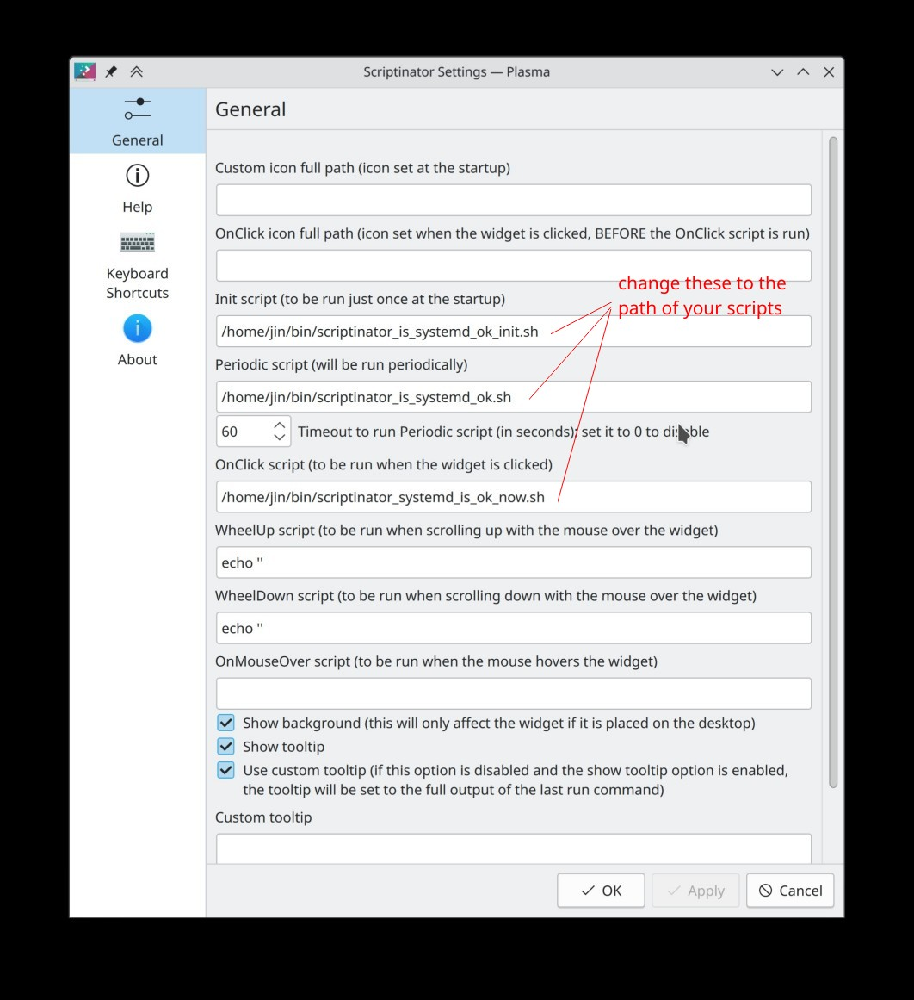

# systemd monitor

This example notifies you when a systemd service fails.

## Installation

1. Install the Scriptinator applet.
2. Add the Scriptinator applet to your panel, or to system tray (set it as "show when relevant).
3. Right-click the Scriptinator applet and select "Configure".
4. Configure it as the screenshot below, change paths to where you have the files:


## Usage

1. When a service fails, the applet will change to a "error" icon and appear in the system tray.
2. Hover over the icon to see the error message.
3. Click on the icon to dismiss it.

## Troubleshooting

If you don't see the icons, or you want to use different icons, change the following lines in *.sh:

```text
{PlasmoidIconStart}system-run{PlasmoidIconEnd}
{PlasmoidIconStart}computer-fail-symbolic{PlasmoidIconEnd}
```
